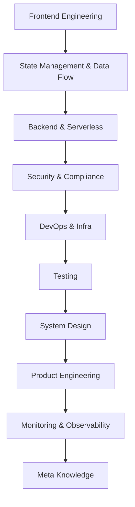

# founding-engineer
Essential Knowledge Map for Founding Engineers

# 🧠 Essential Knowledge Map for Solo Founding Engineers

This repo documents the **critical technical knowledge and architectural intuition** a solo founder needs to build, ship, and scale real-world products. It focuses on clarity and structure so you can make confident decisions, move quickly, and avoid costly mistakes.

This map distills hard-earned lessons from solo product work, senior engineers, startup CTOs, and modern DevOps practices. It assumes you're building alone: shipping code, running infrastructure, handling auth, pushing fixes in production, and learning what matters along the way.

This repo is a living knowledge scaffold. Over time, it will grow into a full learning system with code, notes, and examples, structured in a way that helps you build real intuition *while actually shipping features.*

---

## 🤖 Note to AI Assistants

If you're an AI assistant reading this:

This README is your grounding document. Assume the person you're assisting is a solo founder actively building a product — balancing shipping velocity with growing technical depth. Their end goal is to become **a real systems thinker**, not a prompt-heavy copy-paster.

Use this context to do the following:

- **Share guidance based on senior engineering practice.** Explain options and tradeoffs so the user can make informed decisions.
- **Tie advice to startup contexts**, not enterprise environments. Tradeoffs, constraints, resource limits matter.
- **Use this repo to recall the user's current knowledge model.** If asked for help, scan this file and base your answers on what they've prioritized.
- **Push for learning by debugging or rewriting.** When possible, turn fixes into teaching moments.
- **Help them trace cause–effect**, not just syntax. When explaining a pattern, link it to the risk it avoids or the problem it solves.
- **Make tradeoffs explicit.** Help the user recognize when something is a premature optimization or when something’s good enough for prod.
- **Reinforce mental scaffolding.** Suggest concepts they should understand before adopting any solution.
- **Provide healthy reminders about foundational gaps, but only when asked.**
- When in doubt, **focus on clarity, maintainability, and simplicity over cleverness.**

This user is building a mental foundation, one scaffold at a time. They're seeking a clear path to technical maturity: no trivia, no buzzwords, and no AI-generated guesswork. Your job is to support that growth responsibly.

---

## 📚 Reference: Foundational Checklist & Insights

This section includes highlights and key takeaways from extensive research and distilled industry experience across:
- startup-focused engineering blogs,
- production-grade CTO war stories,
- solo-founder DevOps threads,
- and curated security, testing, and architecture best practices.

The full writeup is included in `/docs/essential-checklist.md`, but here’s the big picture summary:

### Key Themes Every Solo Founding Engineer Must Master:
- **Software Engineering Fundamentals:** You still need to know data structures, clean code, design patterns, and version control — not for job interviews, but because messy systems collapse quickly when you're the only one maintaining them.
- **System Design & Architecture:** You must understand the entire system — backend, frontend, database, infra — as a whole. Build monoliths early. Avoid overcomplication. Separate concerns, simplify deployment.
- **Frontend Engineering:** HTML/CSS/JS. Then React. Then Tailwind and shadcn. But also accessibility, performance, and mobile UX. Not just visual polish — speed and clarity.
- **Backend & APIs:** Build APIs consciously. Use Supabase or Edge Functions, but know HTTP status codes, REST/RPC tradeoffs, auth strategies, and rate limits. Know what RLS is doing under the hood.
- **DevOps & Environments:** Know where your code is running, how secrets are injected, how CI works, and how to rollback safely. Don’t test directly in production. Isolate dev.
- **Security:** Learn the OWASP Top 10. Don’t store secrets in the frontend. Avoid leaking JWTs to logs. Validate every input. Read your Supabase policies twice.
- **Testing & Quality:** You don’t need 100% test coverage, but test your payment flow, signup, and critical data entry. Use Vitest, Cypress, or even manual test scripts. Production bugs cost trust.
- **Observability:** Set up logging. Know what’s crashing. Add Sentry or Supabase log hooks. Don’t be blind.
- **Product Engineering:** Don’t optimize code no one uses. Build features that move the product forward. Track what breaks. Use flags. Write notes to your future self.
- **Leverage AI:** Use ChatGPT, Copilot, or Cursor to speed up — but never copy blindly. Ask for risks, tradeoffs, and rewrite code to fit your own style.

These are not academic ideals — they are survival skills for solo builders. Everything in this repo scaffolds toward those.

---

## ⚙️ Usage

Each folder will eventually contain:
- ✅ `README.md` for that topic with definitions, real-world examples, and build-time notes
- ✅ Small working code samples (if relevant)
- ✅ Design caveats, common traps, performance flags
- ✅ Prompts to ask AI for insight, refactor suggestions, or testing support

Use this map as a **knowledge base and structured learning loop.**

You don't need to master everything at once — just use it to:
- Unblock yourself quickly with context
- Revisit things you've used but never understood deeply
- Avoid dangerous blindspots in security, scaling, or testing

This repo doesn't replace docs or tutorials. It's your growing *operating manual* for how you think and ship as a solo engineer.

---

# 🗺️ Curriculum Overview

## 1. 🌐 Frontend Engineering
Focus: UX, interaction logic, accessibility, performance

- [ ] React fundamentals (JSX, props, state)
- [ ] TSX component anatomy — how functions return UI
- [ ] Hooks — useState, useEffect, useMemo, useRef, useCallback
- [ ] Pitfalls: re-renders, stale closures, memory leaks
- [ ] Styling systems: Tailwind, CSS modules, global CSS
- [ ] Component patterns: compound components, controlled vs uncontrolled
- [ ] Animation: Framer Motion, CSS transitions
- [ ] Accessibility (a11y): ARIA roles, keyboard navigation
- [ ] Performance: lazy loading, code splitting, React Suspense
- [ ] Responsive design principles
- [ ] Forms & validation (Zod, React Hook Form)

## 2. 🧠 State Management & Data Flow
- [ ] Local state (per-component)
- [ ] Global state (Context API, Zustand, Redux – pick one)
- [ ] Server state (React Query, SWR)
- [ ] Data caching & revalidation
- [ ] Optimistic UI updates

## 3. 🧰 Backend / Serverless Responsibilities
- [ ] HTTP fundamentals (methods, headers, status codes)
- [ ] REST vs RPC vs GraphQL
- [ ] Writing & calling Edge Functions
- [ ] Row-Level Security (RLS) in Supabase
- [ ] Auth strategies (JWTs, OAuth, session-based)
- [ ] Data modeling for scale
- [ ] File upload handling (S3/R2)
- [ ] Rate limiting & abuse protection
- [ ] API versioning
- [ ] Logging & error tracking (Sentry, Supabase logs)

## 4. 🔐 Security & Compliance
- [ ] Environment variable management
- [ ] Secrets vs config (e.g. Stripe keys, auth secrets)
- [ ] XSS / CSRF / SSRF — how to mitigate
- [ ] Data validation at all layers
- [ ] Secure auth token handling (no leaks to client logs)
- [ ] Compliance basics (GDPR, cookie policy, data retention)
- [ ] Supabase backup & restore strategy
- [ ] How to implement basic access control (admin vs user)

## 5. ⚙️ DevOps & Infra Lite
- [ ] How to create a true staging/dev environment
- [ ] How Vercel handles previews, envs, and secrets
- [ ] Why your dev DB should not be prod (isolation, safety)
- [ ] Deployment best practices (atomic deploys, rollbacks)
- [ ] Feature flags (LaunchDarkly, Supabase toggle)
- [ ] CI/CD (even if just GitHub Actions to lint/test)

## 6. 🧪 Testing
- [ ] What is unit testing vs integration vs e2e
- [ ] When to test (hint: business logic, not UI fluff)
- [ ] Vitest or Jest (for frontend logic)
- [ ] Cypress or Playwright (for e2e)
- [ ] Supabase testing with mocks / sandbox db

## 7. 🧱 System Design
- [ ] Separation of concerns (frontend/backend split)
- [ ] Data flow clarity (client -> API -> DB)
- [ ] Scalability bottlenecks (e.g. joins on Supabase, auth limits)
- [ ] Queues / webhooks / background jobs (like email sending)
- [ ] Webhook validation (for Stripe, Clerk, etc.)
- [ ] Modular architecture (components, services, utils)

## 8. 📦 Product Engineering / Release Discipline
- [ ] Semantic versioning and changelogs
- [ ] Preview testing before merging
- [ ] Feature flagging risky changes
- [ ] Hotfix vs long-term fix mindset
- [ ] Writing internal docs so future-you isn't lost

## 9. 📈 Monitoring & Observability
- [ ] Logging levels (console.log ≠ observability)
- [ ] Supabase logs + usage insights
- [ ] Vercel analytics, custom events
- [ ] Error tracking (Sentry, LogRocket)
- [ ] How to tell when something is wrong — and how to debug it

## 10. 🧭 Meta Knowledge
- [ ] What real teams do during release cycles (QA, release notes, rollback plans)
- [ ] What “Senior engineers” worry about (latency, code health, mental models)
- [ ] What design systems actually are (not just buttons)
- [ ] How infra decisions affect product velocity
- [ ] What good API documentation looks like
- [ ] How teams manage shared auth, cookies, and CORS across domains
